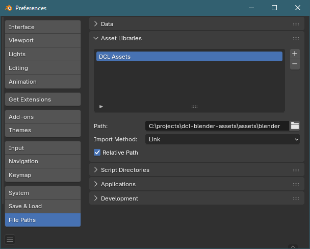
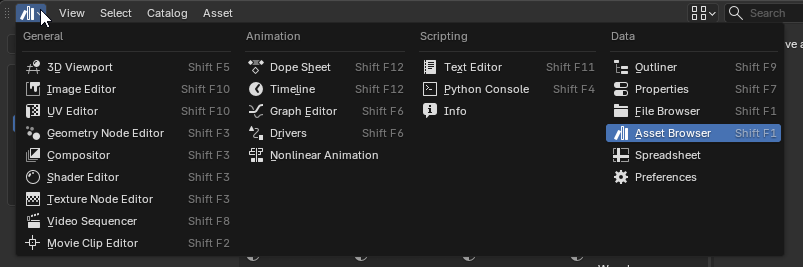
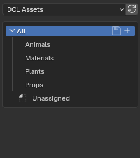
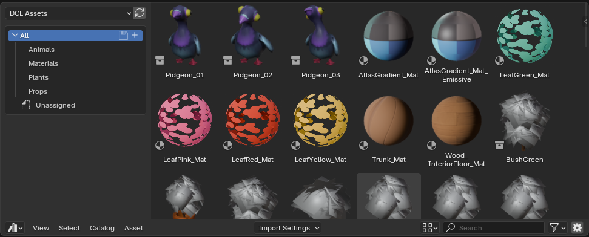

# 🎨 Decentraland Genesis Plaza Assets

This repository contains a curated collection of 3D assets currently used in **Genesis Plaza** in Decentraland.  

The goal of this repo is to provide creators with high-quality, production-ready assets that can be easily reused, modified, and integrated into their own scenes.

All assets are organized as **Blender asset libraries**, making them directly accessible through Blender’s Asset Browser.

---

## 📦 What’s Included

- **.blend files** with assets marked for the Blender Asset System  
- Organized collections of reusable assets  
- Categories such as:
  - **Props** – meshes and scene objects
  - **Materials** – reusable shaders and textures  

> More categories may be added over time (e.g. environments, decals, shaders).

---

## 🚀 Getting Started

### 1. Clone the Repository

```bash
git clone https://github.com/stom66/dcl-blender-assets.git
```

Or download it as a ZIP if you prefer.

---

### 2. Add to Blender Asset Library

1. Open **Blender**
2. Go to **Edit → Preferences → File Paths**
3. Under **Asset Libraries**, click **+**
4. Select the `blender` folder inside the `assets` folder of this repository
5. Double click it to rename it (e.g. `DCL Assets`)

📸 _Screenshot: Blender Preferences → File paths → Asset Libraries_


---

### 3. Access the Assets

1. Create a new viewport section
1. Change the viewport type to **Asset Browser**
2. Select your newly added library from the dropdown  

3. Browse assets by category (Props, Materials, etc.)  


---

## 🧩 Using the Assets

Blender provides two main ways to use assets:

### Append
- Creates a **local copy** of the asset in your file  
- Fully editable and independent  
- Changes will **not** affect the original asset  

**Best for:** customization and one-off use

---

### Link
- References the asset from the library file  
- Keeps files lightweight and consistent  
- Updates to the source asset can propagate  

**Best for:** shared assets across multiple scenes/projects

---


### Notes:
- Keep **Blender files modular** (one category or theme per file)
- Avoid packing textures long-term; instead reference `/textures`
- Use consistent naming conventions for assets and collections

---

## 🧱 Asset Guidelines

- Assets are marked using Blender’s **Asset Browser system**
- Collections are structured for easy drag-and-drop usage
- Naming is consistent and descriptive
- Optimized for real-time environments where possible, (e.g., LODs, optimized poly-counts)

---

## 📜 License

See the license here: [COPYING](COPYING)

> TODO: add the correct license type

---

## 🤝 Contributing

Contributions are welcome!  

If you’d like to add or improve assets:
- Follow the existing folder structure
- Ensure assets are properly marked in Blender
- Keep files clean (remove unused data, apply transforms, etc.)

---

## 💡 Future Plans

- Substance Painter material support?
- Expanded asset categories